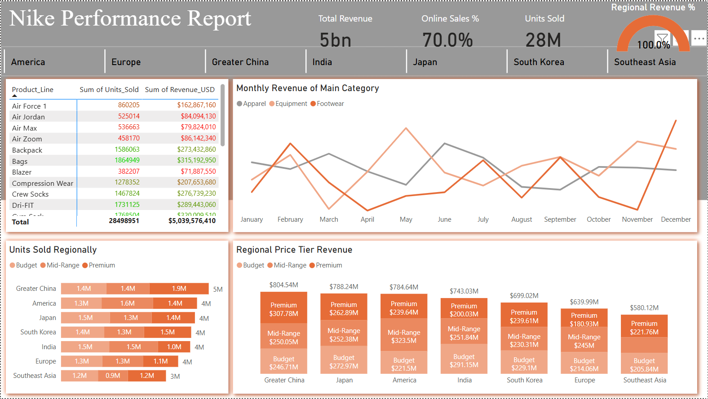

# Nike Performance Report

# Background and Overview:

Nike, the global sneaker giant, established in 1964 is a multinational athletic ecommerce company that sells an array of consumer goods. 

The company has a significant amount of data pertaining to sales over the year for 2024. This report thoroughly analyzes and synthesizes this data in order to give insight on the performance of different regions and price tiers based on revenue and units sold. in addition to unearthing sales trends month to month.

# Insights and recommendations are provided on the following key areas:

Regional comparisons: An evaluation of regions based on revenue 
Sales trends analysis: Evaluation of monthly sales patterns based on product categories, units sold and revenue.
Product Level Performance: An analysis of Nike’s various main category products, subcategory products, and product lines

An interactive PowerBI dashboard can be downloaded here
The SQL queries utilized to inspect and perform quality checks can be found here
The SQL queries utilized to clean, Organize, and prepare data for the dashboard can be found here
Targeted SQL queries regarding various business questions can be found here

# Static Dashboard: 

# Executive Summary:
In 2024, Greater China emerged as the top-performing region, generating the highest revenue at $805 million. Revenue distribution across all regions was relatively balanced, with Americas and Japan each contributing 15.6%, Europe accounting for 12.7%, India at 14.7%, South Korea at 13.9%, and Southeast Asia at 11.5%. Although Greater China led the way, the overall distribution indicates strong global performance with no region overwhelmingly dominating, reflecting a healthy diversification of sales across markets.
Sales trends across the year revealed distinct seasonal patterns for different product categories. Footwear demonstrated significant volatility, with a notable surge in February and a peak in December at $213 million, largely driven by holiday shopping. Apparel sales were more stable, experiencing high points in March and June and minor dips in May and August before regaining momentum in November and December. Equipment, however, saw the most fluctuation, with dramatic rises and falls throughout the year, peaking in May at $202 million before recovering strongly at the end of the year. December consistently stood out as the strongest month across all categories, reinforcing the critical role of the holiday season in driving sales volume.
When analyzing performance by price tier, Premium products led in Greater China, South Korea, and Southeast Asia, while Budget products were the top revenue generators in Japan and India. In America and Europe, Mid-Range products outperformed other tiers. Additionally, online sales accounted for a remarkable 70% of total revenue, underscoring the shift toward digital commerce and its strong influence across all regions and product categories.
Vapor Cricket proved to be the leading product line overall, achieving the highest sales performance with nearly 1.9 million units sold and $384 million in revenue. Regional bestsellers varied significantly, with the Wind runner leading in the Americas, Hats in Europe, Rain Jackets in Greater China and Japan, Tech Fleece in India, Backpacks in South Korea, and Gym Sacks in Southeast Asia. These trends highlight the diverse consumer preferences across regions and the importance of localized product strategies in driving overall sales success.

# Recommendations: 
While Nike achieved strong global performance in 2024, there are clear opportunities for growth and refinement. To strengthen results further, Nike could focus on addressing seasonal sales dips by launching targeted marketing campaigns and limited product drops during months with lower revenue, especially in categories like Equipment where volatility was highest. Additionally, building momentum around best-selling products such as Vapor Cricket by introducing new variations, exclusive collaborations, or regional limited editions could help push even greater unit sales. Coming out of 2024, Nike looks exceptionally strong with balanced regional contributions and a dominant online sales presence, setting a solid foundation for future growth. To maintain high performance during peak months like December, Nike should continue to invest heavily in digital promotions, influencer partnerships, and loyalty programs that amplify already strong consumer demand. Greater China is currently carrying the team with the highest revenue, but Southeast Asia, contributing the lowest share at 11.5%, presents a clear opportunity; localized campaigns, expanded online presence, and tailoring popular products like Gym Sacks and Vapor Cricket to regional tastes could help elevate this market's performance and further solidify Nike’s global dominance.
